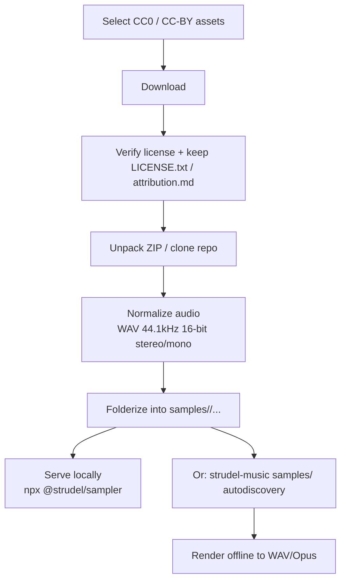

# Creative Commons Sample Packs and Tracker Modules for Headless Strudel Pipelines

## Executive summary

This report inventories **Creative Commons (CC0/CC‑BY/CC‑BY‑NC/CC‑BY‑NC‑SA/CC‑BY‑NC‑ND)** and **public-domain–style** audio assets that are **explicitly CC-licensed** and **currently accessible** (as of **February 22, 2026**, America/Los_Angeles) for use in a **headless Strudel sample pipeline**, with a strong preference for **WAV-ready** packs and **primary/official pages**.

Key findings:

* **entity["organization","Signature Sounds","cc0 sample packs site"]** is currently one of the simplest “plug-and-go” sources for **CC0** sample packs aimed at **music production**, with clear “Royalty‑Free (CC0)” language on individual pack pages and a site statement that the catalog is shared under an open CC0 license. citeturn30view0turn30view1turn16view0turn15view1turn30view2turn30view3  
* **entity["organization","OpenGameArt.org","open asset repository"]** has many **CC0** downloadable ZIP packs (often SFX-oriented). These are excellent for percussive/foley textures and game-y palettes; however, the embedded ZIP contents are not always enumerated on the page (so you should verify formats after download). citeturn14view0turn14view1turn14view2turn25view0turn25view1turn25view2  
* **entity["organization","The Mod Archive","tracker module archive"]** provides individual **tracker modules (.xm/.it)** with explicit CC license tags and **MD5 checksums**, plus mirrors. These are best treated as “score + instrument set” assets you can render to audio in a preprocessing step before feeding into Strudel. citeturn12view0turn12view1turn31view0  
* **entity["organization","Internet Archive","digital library archive"]** hosts some credible CC‑BY sample collections, including an explicitly CC‑BY “Volca Modular drum kit” pack with license text included on the item page. citeturn26view0  
* **entity["company","GitHub","code hosting platform"]** hosts small CC0 sample repos used in the Tidal/Strudel ecosystem (e.g., TR‑808 hits). These can be integrated via `git clone` and folder mapping, though size/metadata may require local inspection. citeturn24view1turn24view0  

Recommended “top 10” for immediate Strudel use (CC0/CC‑BY; prioritized for clear licensing + practical integration):

1. Signature Sounds — Homemade Drum Kit (CC0, WAV, ~8MB) citeturn30view1  
2. Signature Sounds — Coca‑Cola Drum Kit (CC0, WAV, ~6MB) citeturn15view1  
3. Signature Sounds — Foley FX Drum Kit (CC0, WAV, ~85MB) citeturn16view0  
4. Signature Sounds — Forest Organics Drum Kit (CC0, WAV, ~68MB) citeturn30view2  
5. Signature Sounds — Orchestral CC0 (CC0, WAV, ~87MB zipped) citeturn30view3  
6. OpenGameArt — 100 CC0 SFX (CC0, ZIP ~2.9MB) citeturn25view2  
7. OpenGameArt — 100 CC0 SFX #2 (CC0, ZIP ~2.4MB) citeturn14view1  
8. OpenGameArt — 60 CC0 Sci‑Fi SFX (CC0, ZIP ~9.2MB) citeturn25view1  
9. Internet Archive — Beckstrom “Korg Volca Modular drum kit samples” (CC‑BY 4.0, FLAC, 58.1MB) citeturn26view0  
10. GitHub — tidalcycles/sounds‑tr808‑fischer (CC0 repository; TR‑808 one‑shots) citeturn24view1  

## Strudel ingestion requirements and constraints

### What Strudel expects

Strudel’s sample workflow is fundamentally “**folder → sound name → numbered samples**”:

* When importing a local folder (REPL UI), subfolders become **sound names**, and files in each subfolder are indexed from **0** in alphabetical order. citeturn2search2  
* For headless/local serving, the recommended approach is running **`npx @strudel/sampler`** inside a samples directory, then pointing Strudel at the local URL with `samples('http://localhost:5432/')`. citeturn2search2turn2search7  

### What karmaterminal/strudel-music adds (headless pipeline orientation)

The repository at **karmaterminal/strudel-music** describes a headless workflow: prompt → Strudel pattern → offline rendering → WAV/encoded output, with sample playback mapping to on-disk WAV assets. It also documents:

* a setup step that downloads drum samples,
* a `samples/` directory auto-discovery behavior for WAV folders, and
* a script interface for adding packs by URL or local directory. citeturn4view0  

In practical terms, for a “sample pack” to work cleanly in the pipeline, you want:

* **WAV preferred** (or a deterministic conversion step from FLAC/OGG/AIFF → WAV),
* stable folder naming for sound identifiers,
* and license metadata you can preserve alongside the audio.

## Top recommended CC0 and CC‑BY packs with practical “why”

### Signature Sounds (CC0, producer-friendly)
Signature Sounds’ “Soundbank” page explicitly frames the site’s free packs as shared under an **open CC0 license**, which supports commercial and non-commercial use without attribution. citeturn30view0  
The following packs are especially Strudel-friendly because they explicitly list **WAV** and **small-to-medium sizes** directly on the pack pages:

* **Homemade Drum Kit** — 150+ drum sounds (kicks/snares/hats/perc/FX), WAV, ~8MB. citeturn30view1  
* **Coca‑Cola Drum Kit** — 200+ drum/FX/foley sounds, WAV, ~6MB (unzipped). citeturn15view1  
* **Foley FX Drum Kit** — 200 drum sounds, WAV, ~85MB. citeturn16view0  
* **Forest Organics Drum Kit** — 500 natural drum sounds, WAV, ~68MB. citeturn30view2  
* **Orchestral CC0** — 23 orchestral loops & instrument material, WAV, ~87MB zipped. citeturn30view3  

These cover: clean percussion, “found object” textures, organic/natural hits, and cinematic loop material—all strong inputs for generative patterning.

### OpenGameArt (CC0 “texture library”)
OpenGameArt provides CC0 ZIP downloads with listed sizes and publication dates on each page. These are often labeled as “sound effects,” but they integrate extremely well into Strudel as percussion/foley/texture banks.

Notable packs (all CC0 per page license field):

* “100 CC0 SFX” (~2.9MB ZIP). citeturn25view2  
* “100 CC0 SFX #2” (~2.4MB ZIP). citeturn14view1  
* “80 CC0 RPG SFX” (~1.8MB ZIP). citeturn14view2  
* “60 CC0 Sci‑Fi SFX” (~9.2MB ZIP). citeturn25view1  
* “100 CC0 metal and wood SFX” (~2MB ZIP). citeturn25view0  
* “sound pack” (UI sounds; ~438.6KB ZIP; Dec 19, 2025). citeturn14view0  

### Internet Archive (CC‑BY example with explicit on-page license)
The “Beckstrom – Korg Volca Modular drum kit samples” item page includes **Usage: Attribution 4.0 International** and also embeds a license section explaining CC‑BY with attribution request. It lists **Item Size: 58.1M** and provides a **download list** (FLAC files). citeturn26view0  

This is a high-quality example of a pack where the **license text is present on the primary page**, making downstream compliance much easier.

## Catalog of current CC packs and tracker modules

The table below is a practical “short catalog” of assets verified to have **explicit CC licensing statements** on their primary pages (or repository license metadata), along with the integration notes you’d need for a headless pipeline.

| ID | Item | Author/Curator | Type | License | Formats | Size | Availability | Notes for Strudel |
|---|---|---|---|---|---|---:|---|---|
| sig_homemade | Homemade Drum Kit | Signature Sounds | WAV pack | CC0 | WAV | 8 MB | Hosted; “instant download” via product page | Great core one-shots; split into `kick/sd/hh/perc/fx` folders. citeturn30view1turn30view0 |
| sig_coke | Coca‑Cola Drum Kit | Signature Sounds | WAV pack | CC0 | WAV | 6 MB (unzipped) | Hosted; instant download | Foley-ish drum textures; easy “one folder = one sound bank” setup. citeturn15view1turn30view0 |
| sig_foley_fx | Foley FX Drum Kit | Signature Sounds | WAV pack | CC0 | WAV | 85 MB (unzipped) | Hosted; instant download | Broad palette; good for generative “texture-percussion.” citeturn16view0turn30view0 |
| sig_forest | Forest Organics Drum Kit | Signature Sounds | WAV pack | CC0 | WAV | 68 MB (unzipped) | Hosted; instant download | Organic hits/perc; strong for ambient/ritual palettes. citeturn30view2turn30view0 |
| sig_orch | Orchestral CC0 | Signature Sounds | Loop pack | CC0 | WAV | 87 MB (zipped) | Hosted; instant download | Loops: consider tagging by tempo/key after unpack. citeturn30view3turn30view0 |
| oga_ui_2025 | sound pack | StumpyStrust | ZIP pack | CC0 | ZIP (contents not enumerated) | 0.43 MB | Hosted download | UI/bleeps; verify internal file formats after unzip. citeturn14view0 |
| oga_100_sfx | 100 CC0 SFX | rubberduck | ZIP pack | CC0 | ZIP (contents not enumerated) | 2.9 MB | Hosted download | Strong general SFX→percussion fodder; sort into categories. citeturn25view2 |
| oga_100_sfx_v2 | 100 CC0 SFX #2 | rubberduck | ZIP pack | CC0 | ZIP (contents not enumerated) | 2.4 MB | Hosted download | More loops/ambience + hits; verify formats. citeturn14view1 |
| oga_metal_wood | 100 CC0 metal and wood SFX | rubberduck | ZIP pack | CC0 | ZIP (contents not enumerated) | 2.0 MB | Hosted download | Great “found percussion” layer; categorize by material. citeturn25view0 |
| oga_rpg | 80 CC0 RPG SFX | rubberduck | ZIP pack | CC0 | ZIP (contents not enumerated) | 1.8 MB | Hosted download | Weapon/coin/hit sounds become strong transient kits. citeturn14view2 |
| oga_scifi | 60 CC0 Sci‑Fi SFX | rubberduck | ZIP pack | CC0 | ZIP (contents not enumerated) | 9.2 MB | Hosted download | Beeps/lasers/ambience: excellent for “sci-fi drums.” citeturn25view1 |
| ia_volca | Beckstrom – Korg Volca Modular drum kit samples | Chris Beckstrom | Sample set | CC‑BY 4.0 | FLAC | 58.1 MB | Hosted download (129 files) | Convert FLAC→WAV; attribution required. citeturn26view0 |
| gh_tr808 | tidalcycles/sounds‑tr808‑fischer | tidalcycles | Sample repo | CC0 | WAV (repo folders) | (local inspect) | Git clone | TR‑808 kit; integrate as `samples/tr808/*`. citeturn24view1 |
| gh_repetition | tidalcycles/sounds‑repetition | tidalcycles | Sample repo | CC0 | WAV (repo folders) | (local inspect) | Git clone | Speech-y textures; good for glitch/vox patterns. citeturn24view0 |
| mod_sinister | ant512_-_something_sinister.xm | ant512 | Tracker module | CC Attribution | XM | 20.66 KB | Hosted + mirrors; MD5 provided | Render to WAV for Strudel; attribution required. citeturn12view0 |
| mod_flowaway | let_it_flow_away.xm | Ibon Moraza Garcia (NEtbuRNER) | Tracker module | CC BY‑NC‑ND | XM | 512.49 KB | Hosted + mirrors; MD5 provided | **NC + ND restriction**: avoid commercial and avoid derivatives. citeturn12view1 |
| mod_arrival | saga_musix_-_arrival.it | Saga Musix | Tracker module | CC BY‑NC‑SA | IT | 7.61 MB | Hosted + mirrors; MD5 provided | **NC + SA**: no commercial; derivatives must be SA. citeturn31view0 |

Licensing note: Signature Sounds states the site’s packs are shared under CC0 broadly; individual pack pages also label “Royalty‑Free (CC0).” citeturn30view0turn30view1  

## Practical ingestion workflow for headless Strudel

### Recommended ingestion pipeline



This aligns with Strudel’s documented local sample serving workflow via `@strudel/sampler` citeturn2search2turn2search7 and with strudel-music’s headless “Prompt → Pattern → OfflineAudioContext → WAV” approach and its `samples/` folder auto-discovery. citeturn4view0  

### Folder layout conventions that work well

To satisfy both Strudel conventions and a headless “sample bank” design, a safe convention is:

*One sound-name folder per playable instrument bank:*  
`samples/<soundname>/*.wav`

If a pack contains categories, split into multiple sound folders:

* `samples/sig_homemade_kick/*.wav`  
* `samples/sig_homemade_snare/*.wav`  
* `samples/sig_homemade_hat/*.wav`  
* `samples/sig_homemade_perc/*.wav`  

That yields direct usage like:

* `s("sig_homemade_kick:0 sig_homemade_snare:2")`

The Strudel docs explicitly describe folder-based grouping and numeric indexing. citeturn2search2  
strudel-music also documents that WAV directories under `samples/` are auto-discovered and can be used by directory name in `s("<dirname>")`. citeturn4view0  

### Tracker modules: how to treat .xm/.it in a Strudel pipeline

Strudel is oriented around **audio samples**, not tracker playback. For module assets from ModArchive:

1. Download `.xm/.it`.  
2. Render modules to WAV offline (e.g., via an OpenMPT/libopenmpt-based renderer in your pipeline).  
3. Optional: slice the rendered WAV into loops/phrases and store them as Strudel sample banks.

This approach keeps the original module file and license text for compliance and reproducibility. ModArchive provides **MD5** and explicit CC license tags per module. citeturn12view0turn12view1turn31view0  

## Licensing and restrictions checklist

### CC0
CC0 is easiest operationally: you can redistribute, modify, and use commercially **without attribution** (though credit is still appreciated in many communities). Signature Sounds positions its site’s packs under CC0, and many packs explicitly label “Royalty‑Free (CC0).” citeturn30view0turn30view1  

### CC‑BY
CC‑BY requires **attribution**. The Beckstrom Volca Modular pack explicitly requests credit and lists “Attribution 4.0 International.” citeturn26view0  

### CC‑BY‑NC / CC‑BY‑NC‑SA / CC‑BY‑NC‑ND (modules in this report)
“NC” and “ND” are usually friction points for generative pipelines:

* **NC** can block commercial use and can complicate distribution.  
* **ND** (no derivatives) can conflict with common processing steps (trimming, normalizing, slicing, time-stretch).  
* **SA** (share-alike) is feasible but requires you to license derivatives compatibly.

The example modules included here show these restrictions explicitly on ModArchive pages. citeturn12view1turn31view0  

## Machine-readable JSON index and Strudel manifest

### JSON index

```json
{
  "generated_at_local": "2026-02-22",
  "format_version": "1.0",
  "pipeline_target": "headless Strudel (karmaterminal/strudel-music) + Strudel REPL via @strudel/sampler",
  "license_policy": {
    "preferred": ["CC0-1.0", "CC-BY-4.0", "CC-BY-3.0"],
    "flagged": ["CC-BY-NC-*", "CC-BY-*-ND", "CC-BY-NC-SA-*"]
  },
  "items": [
    {
      "id": "sig_homemade",
      "title": "Homemade Drum Kit",
      "creator": "Signature Sounds (Phil)",
      "type": "sample_pack",
      "license": {
        "id": "CC0-1.0",
        "requirements": { "attribution": false, "share_alike": false, "non_commercial": false, "no_derivatives": false }
      },
      "formats": ["wav"],
      "size_mb": 8,
      "page_url": "https://signaturesounds.org/store/p/homemade-drum-kit",
      "direct_download_urls": [],
      "availability": { "hosting": "hosted", "lead_time": "instant (free checkout)", "mirrors": [] },
      "last_updated": null,
      "tags": ["drums", "foley", "lofi", "hip-hop", "experimental"],
      "tempo_metadata": null,
      "checksums": null,
      "strudel_layout_suggestion": {
        "base_dir": "samples/",
        "sound_folders": [
          "sig_homemade_kick/",
          "sig_homemade_snare/",
          "sig_homemade_hat/",
          "sig_homemade_perc/",
          "sig_homemade_fx/"
        ],
        "note": "Unpack and re-folder by category; Strudel indexes files alphabetically per folder."
      }
    },
    {
      "id": "sig_coke",
      "title": "Coca-Cola Drum Kit",
      "creator": "Signature Sounds",
      "type": "sample_pack",
      "license": { "id": "CC0-1.0", "requirements": { "attribution": false, "share_alike": false, "non_commercial": false, "no_derivatives": false } },
      "formats": ["wav"],
      "size_mb": 6,
      "page_url": "https://signaturesounds.org/store/p/coca-cola-drum-kit",
      "direct_download_urls": [],
      "availability": { "hosting": "hosted", "lead_time": "instant (free checkout)", "mirrors": [] },
      "last_updated": null,
      "tags": ["foley", "drums", "objects", "pop"],
      "tempo_metadata": null,
      "checksums": null,
      "strudel_layout_suggestion": { "base_dir": "samples/", "sound_folders": ["sig_coke/"], "note": "Keep as one bank for quick use: s('sig_coke:0 sig_coke:1')." }
    },
    {
      "id": "sig_foley_fx",
      "title": "Foley FX Drum Kit",
      "creator": "Signature Sounds",
      "type": "sample_pack",
      "license": { "id": "CC0-1.0", "requirements": { "attribution": false, "share_alike": false, "non_commercial": false, "no_derivatives": false } },
      "formats": ["wav"],
      "size_mb": 85,
      "page_url": "https://signaturesounds.org/store/p/foley-fx-drum-kit",
      "direct_download_urls": [],
      "availability": { "hosting": "hosted", "lead_time": "instant (free checkout)", "mirrors": [] },
      "last_updated": null,
      "tags": ["drums", "foley", "textures"],
      "tempo_metadata": null,
      "checksums": null,
      "strudel_layout_suggestion": { "base_dir": "samples/", "sound_folders": ["sig_foley_fx/"], "note": "Optionally split into sub-banks if too large." }
    },
    {
      "id": "sig_forest",
      "title": "Forest Organics Drum Kit",
      "creator": "Signature Sounds",
      "type": "sample_pack",
      "license": { "id": "CC0-1.0", "requirements": { "attribution": false, "share_alike": false, "non_commercial": false, "no_derivatives": false } },
      "formats": ["wav"],
      "size_mb": 68,
      "page_url": "https://signaturesounds.org/store/p/about-the-free-forest-organics-drum-kit",
      "direct_download_urls": [],
      "availability": { "hosting": "hosted", "lead_time": "instant (free checkout)", "mirrors": [] },
      "last_updated": null,
      "tags": ["drums", "organic", "ambient", "experimental"],
      "tempo_metadata": null,
      "checksums": null,
      "strudel_layout_suggestion": { "base_dir": "samples/", "sound_folders": ["sig_forest/"], "note": "Natural palette; good for 'ritual/organic percussion' moods." }
    },
    {
      "id": "sig_orch",
      "title": "Orchestral CC0",
      "creator": "Signature Sounds",
      "type": "loop_pack",
      "license": { "id": "CC0-1.0", "requirements": { "attribution": false, "share_alike": false, "non_commercial": false, "no_derivatives": false } },
      "formats": ["wav"],
      "size_mb": 87,
      "page_url": "https://signaturesounds.org/store/p/orchestral-cc0",
      "direct_download_urls": [],
      "availability": { "hosting": "hosted", "lead_time": "instant (free checkout)", "mirrors": [] },
      "last_updated": null,
      "tags": ["orchestral", "cinematic", "loops"],
      "tempo_metadata": { "bpm": null, "key": null },
      "checksums": null,
      "strudel_layout_suggestion": { "base_dir": "samples/", "sound_folders": ["sig_orch/"], "note": "After unpack, consider renaming with bpm/key if provided in filenames." }
    },
    {
      "id": "oga_ui_2025",
      "title": "sound pack",
      "creator": "StumpyStrust",
      "type": "zip_pack",
      "license": { "id": "CC0-1.0", "requirements": { "attribution": false, "share_alike": false, "non_commercial": false, "no_derivatives": false } },
      "formats": ["zip"],
      "size_mb": 0.43,
      "page_url": "https://opengameart.org/content/sound-pack",
      "direct_download_urls": ["https://opengameart.org/sites/default/files/archive.zip"],
      "availability": { "hosting": "hosted", "lead_time": "instant", "mirrors": [] },
      "last_updated": "2025-12-19",
      "tags": ["ui", "bleeps"],
      "tempo_metadata": null,
      "checksums": null,
      "strudel_layout_suggestion": { "base_dir": "samples/", "sound_folders": ["oga_ui/"], "note": "Verify contained formats; convert to WAV if needed." }
    },
    {
      "id": "oga_100_sfx",
      "title": "100 CC0 SFX",
      "creator": "rubberduck",
      "type": "zip_pack",
      "license": { "id": "CC0-1.0", "requirements": { "attribution": false, "share_alike": false, "non_commercial": false, "no_derivatives": false } },
      "formats": ["zip"],
      "size_mb": 2.9,
      "page_url": "https://opengameart.org/content/100-cc0-sfx",
      "direct_download_urls": ["https://opengameart.org/sites/default/files/100-CC0-SFX.zip"],
      "availability": { "hosting": "hosted", "lead_time": "instant", "mirrors": [] },
      "last_updated": "2018-06-29",
      "tags": ["foley", "hits", "doors", "metal", "misc"],
      "tempo_metadata": null,
      "checksums": null,
      "strudel_layout_suggestion": { "base_dir": "samples/", "sound_folders": ["oga_foley_hits/"], "note": "Sort into transient folders (hit/metal/wood/etc.) for better semantic control." }
    },
    {
      "id": "oga_100_sfx_v2",
      "title": "100 CC0 SFX #2",
      "creator": "rubberduck",
      "type": "zip_pack",
      "license": { "id": "CC0-1.0", "requirements": { "attribution": false, "share_alike": false, "non_commercial": false, "no_derivatives": false } },
      "formats": ["zip"],
      "size_mb": 2.4,
      "page_url": "https://opengameart.org/content/100-cc0-sfx-2",
      "direct_download_urls": ["https://opengameart.org/sites/default/files/sfx_100_v2.zip"],
      "availability": { "hosting": "hosted", "lead_time": "instant", "mirrors": [] },
      "last_updated": "2018-10-26",
      "tags": ["ambient", "loops", "foley"],
      "tempo_metadata": null,
      "checksums": null,
      "strudel_layout_suggestion": { "base_dir": "samples/", "sound_folders": ["oga_sfx2/"], "note": "Verify loop files vs one-shots; consider separate banks." }
    },
    {
      "id": "ia_volca",
      "title": "Beckstrom - Korg Volca Modular drum kit samples",
      "creator": "Chris Beckstrom",
      "type": "sample_set",
      "license": { "id": "CC-BY-4.0", "requirements": { "attribution": true, "share_alike": false, "non_commercial": false, "no_derivatives": false } },
      "formats": ["flac"],
      "size_mb": 58.1,
      "page_url": "https://archive.org/details/beckstrom-volca-modular-drum-samples-1",
      "direct_download_urls": ["https://archive.org/download/beckstrom-volca-modular-drum-samples-1/"],
      "availability": { "hosting": "hosted", "lead_time": "instant", "mirrors": ["archive.org mirrors/CDN"] },
      "last_updated": "2021-02-05",
      "tags": ["synth", "drums", "volca", "modular", "analog", "lofi"],
      "tempo_metadata": null,
      "checksums": null,
      "strudel_layout_suggestion": { "base_dir": "samples/", "sound_folders": ["beckstrom_volca/"], "note": "Batch convert FLAC->WAV before ingest; keep ATTRIBUTION.md." }
    },
    {
      "id": "mod_sinister",
      "title": "ant512_-_something_sinister.xm",
      "creator": "ant512",
      "type": "tracker_module",
      "license": { "id": "CC-BY (Attribution)", "requirements": { "attribution": true, "share_alike": false, "non_commercial": false, "no_derivatives": false } },
      "formats": ["xm"],
      "size_mb": 0.02,
      "page_url": "https://modarchive.org/index.php?request=view_by_moduleid&query=186833",
      "direct_download_urls": ["https://api.modarchive.org/downloads.php?moduleid=186833"],
      "availability": { "hosting": "hosted", "lead_time": "instant", "mirrors": ["SceneSat/modarchive mirrors"] },
      "last_updated": "2019-10-13",
      "tags": ["chiptune", "module"],
      "tempo_metadata": null,
      "checksums": { "md5": "4102d600206a07f4dbc7a88f1b75952e" },
      "strudel_layout_suggestion": { "note": "Render XM -> WAV loops/stems before Strudel; attribute the author." }
    }
  ]
}
```

### Markdown manifest with copy-paste ingestion instructions

```md
# CC Sample Packs + Tracker Modules for Strudel (Headless)

This manifest is designed for:
- Strudel REPL local serving via `npx @strudel/sampler` (recommended)
- karmaterminal/strudel-music `samples/` autodiscovery

## Common setup

### Create a workspace
mkdir -p packs downloads samples

### Start a local sample server (optional, but useful)
# Put your sample folders inside ./samples first, then:
cd samples
npx @strudel/sampler
# In Strudel:
# samples('http://localhost:5432/');

### Normalize audio (recommended)
# Convert non-WAV formats to WAV (example for FLAC -> WAV):
# ffmpeg -i input.flac -ar 44100 -ac 2 -sample_fmt s16 output.wav

---

## Signature Sounds (CC0; manual download via product pages)
NOTE: These packs are hosted as “free checkout / instant download” products.
Download them manually, then unpack into `samples/` following the suggested folder mapping.

- Homemade Drum Kit (CC0, WAV, ~8MB)
  Page: https://signaturesounds.org/store/p/homemade-drum-kit
  Suggested folders:
    samples/sig_homemade_kick/
    samples/sig_homemade_snare/
    samples/sig_homemade_hat/
    samples/sig_homemade_perc/
    samples/sig_homemade_fx/

- Coca-Cola Drum Kit (CC0, WAV, ~6MB)
  Page: https://signaturesounds.org/store/p/coca-cola-drum-kit
  Suggested folder:
    samples/sig_coke/

- Foley FX Drum Kit (CC0, WAV, ~85MB)
  Page: https://signaturesounds.org/store/p/foley-fx-drum-kit
  Suggested folder:
    samples/sig_foley_fx/

- Forest Organics Drum Kit (CC0, WAV, ~68MB)
  Page: https://signaturesounds.org/store/p/about-the-free-forest-organics-drum-kit
  Suggested folder:
    samples/sig_forest/

- Orchestral CC0 (CC0, WAV loops, ~87MB zipped)
  Page: https://signaturesounds.org/store/p/orchestral-cc0
  Suggested folder:
    samples/sig_orch/

---

## OpenGameArt (CC0; direct ZIP downloads)

Download -> unzip -> convert to WAV if needed -> folderize.

- sound pack (CC0)
  Page: https://opengameart.org/content/sound-pack
  Download:
    curl -L -o downloads/oga_sound_pack.zip "https://opengameart.org/sites/default/files/archive.zip"
    unzip -d packs/oga_sound_pack downloads/oga_sound_pack.zip

- 100 CC0 SFX (CC0)
  Page: https://opengameart.org/content/100-cc0-sfx
  Download:
    curl -L -o downloads/oga_100_cc0_sfx.zip "https://opengameart.org/sites/default/files/100-CC0-SFX.zip"
    unzip -d packs/oga_100_cc0_sfx downloads/oga_100_cc0_sfx.zip

- 100 CC0 SFX #2 (CC0)
  Page: https://opengameart.org/content/100-cc0-sfx-2
  Download:
    curl -L -o downloads/oga_100_cc0_sfx_v2.zip "https://opengameart.org/sites/default/files/sfx_100_v2.zip"
    unzip -d packs/oga_100_cc0_sfx_v2 downloads/oga_100_cc0_sfx_v2.zip

After unpack, move curated WAVs into:
  samples/oga_sfx_hits/
  samples/oga_sfx_metal/
  samples/oga_sfx_wood/
  samples/oga_sfx_ui/
etc.

---

## Internet Archive (CC-BY example; convert FLAC -> WAV)

- Beckstrom - Korg Volca Modular drum kit samples (CC-BY 4.0)
  Page: https://archive.org/details/beckstrom-volca-modular-drum-samples-1
  Download directory listing:
    https://archive.org/download/beckstrom-volca-modular-drum-samples-1/

Recommended: use an Internet Archive downloader (or manual selection), then:
  ffmpeg -i sample.flac -ar 44100 -ac 2 -sample_fmt s16 samples/beckstrom_volca/sample.wav

Keep an ATTRIBUTION.md alongside the samples.

---

## ModArchive tracker modules (render to WAV before Strudel)

Download (files + MD5 are provided on the page):

- ant512_-_something_sinister.xm (CC Attribution)
  Page: https://modarchive.org/index.php?request=view_by_moduleid&query=186833
  Direct:
    curl -L -o downloads/ant512_something_sinister.xm "https://api.modarchive.org/downloads.php?moduleid=186833"
  MD5:
    4102d600206a07f4dbc7a88f1b75952e

Render module -> WAV, then store:
  samples/mod_sinister/mod_sinister.wav
(or slice into multiple loops)

⚠️ Check license restrictions carefully (some modules are CC-BY-NC-ND or CC-BY-NC-SA).
```

Key behavioral references for the manifest:

* Strudel local folder import and `@strudel/sampler` usage are documented in Strudel’s “Samples” docs. citeturn2search2turn2search7  
* strudel-music’s `samples/` auto-discovery and sample pack management workflow are documented in its README. citeturn4view0  

